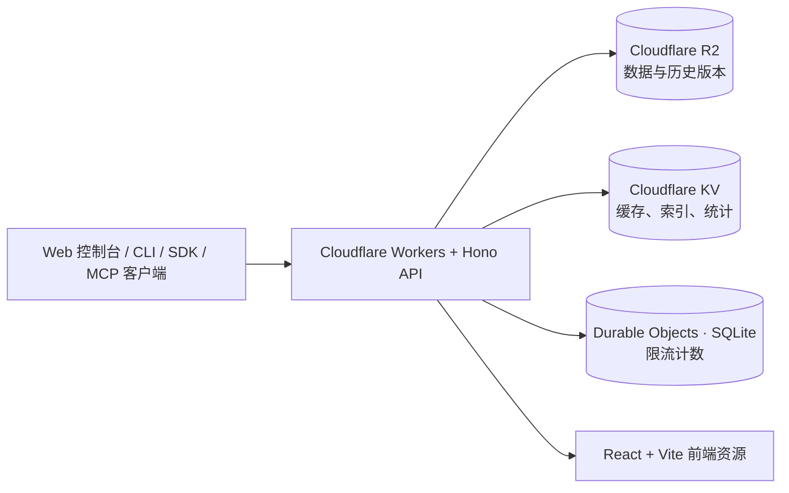

# JSONBin

**基于 Cloudflare 的私有 JSON 数据仓与配置管理平台。**  
一个账号、一套控制台、一组 API，让 JSON 数据的存储、编辑、版本管理和自动化接入更简单。

[](https://github.com/lwhx/jsonbin/actions/workflows/v3-ci.yml)


[功能概览](#核心功能) · [快速开始](#快速开始) · [API 示例](#api-使用示例) · [SDK / CLI / MCP](#开发者接入) · [部署与安全](#部署到-cloudflare) · [详细文档](#相关文档)

---

## 项目介绍

JSONBin 是面向**个人开发者、小型项目和自动化脚本**的自托管 JSON 服务。通过网页控制台管理数据，也可以通过 HTTP API、SDK、CLI 或 MCP 让程序和 AI Agent 访问经过授权的配置。

适合以下场景：

- **应用配置中心**：集中保存脚本、网站、Cloudflare Workers、VPS 工具等使用的 JSON。
- **自动化数据仓**：通过 Bearer API Key 读取、修改或发布配置。
- **配置版本发布**：保留编辑历史，区分工作版本与已发布版本，按需回退发布指针。
- **AI 工具集成**：借助 MCP Server 或 SDK，让 Agent 在权限范围内读写指定数据。

> **定位说明**：这是单管理员、自托管的 JSON 数据与配置平台，不是多租户 SaaS，也不以替代 PostgreSQL、MongoDB 等通用数据库为目标。

## 核心功能

| 分类 | 主要能力 |
| --- | --- |
| **数据仓管理** | JSON Bin 创建、读取、编辑、删除；自定义 Slug、标签、收藏、置顶、集合、批量操作 |
| **编辑与校验** | Monaco JSON 编辑器、结构化表单、树形视图、Draft 7 JSON Schema 校验、数据锁与模型锁 |
| **版本与发布** | 不可变历史版本、Diff、历史恢复、版本备注、配置发布与发布指针回滚、ETag 并发保护 |
| **高级 JSON API** | RFC 7396 JSON Merge Patch、RFC 6902 JSON Patch、JSON Pointer 深层读写、条件读取、部分格式导出 |
| **资产与生命周期** | Bin 克隆、JSON 模板、TTL 自动过期、回收站、恢复与永久清理、业务备份与导入 |
| **检索与管理** | 元数据搜索、按标签筛选、可选的 JSON 内容搜索、活动记录、系统设置 |
| **开发者接口** | OpenAPI 3.1、在线 API 调试器、资源级 API Key、TypeScript / Python SDK、CLI、MCP Server、Webhook |
| **可观测性** | API 请求统计与趋势、Endpoint 排行、状态码与延迟分析、密钥使用统计、限流响应 |

所有写入操作遵循资源权限、锁定规则与适用的条件更新要求；具体能力和端点请以 [开发文档](docs/DEVELOPMENT.md) 与 [OpenAPI](#api-使用示例) 为准。

## 技术架构



- **Cloudflare Workers**：运行 HTTP API、认证与定时维护任务。
- **Cloudflare R2**：Bin、历史版本、模型与业务元数据的**权威数据源**。
- **Cloudflare KV**：可重建的缓存、搜索索引及近似统计；不负责最终一致性要求高的业务判定。
- **SQLite-backed Durable Objects**：API Key 与匿名读取的原子固定窗口限流。
- **Hono + TypeScript / React + Vite + Tailwind CSS**：后端与中文管理界面。

无需自建传统应用服务器，也不依赖 D1、MongoDB 或 Redis。数据模型、条件写入和故障恢复约定见 [架构文档](docs/ARCHITECTURE.md)。

## 快速开始

### 运行环境

- **Node.js 22 或更高版本**，建议配合 npm 使用。
- 本地开发可使用 Wrangler / Miniflare 模拟 Cloudflare 绑定。
- 部署需要已启用 **Workers、R2、KV、Durable Objects** 的 Cloudflare 账号；请确认相应套餐的配额。

### 本地开发

```bash
git clone https://github.com/lwhx/jsonbin.git
cd jsonbin
npm ci
cp .dev.vars.example .dev.vars
npm run dev
```

Windows PowerShell 复制环境文件可使用 `Copy-Item .dev.vars.example .dev.vars`。

启动前，打开 `.dev.vars` 并填写**仅供本地使用**的管理员密码和会话密钥：

```dotenv
APP_ORIGIN=http://localhost:5173
ADMIN_USERNAME=admin
ADMIN_PASSWORD=请设置一个独立的强密码
SESSION_SECRET=请替换为至少32字符的随机字符串
```

浏览器访问终端输出的本地地址（默认 `http://localhost:5173`）。不要将真实 `.dev.vars`、密码或 Token 提交至 Git。

### 常用开发命令

| 命令 | 用途 |
| --- | --- |
| `npm run dev` | 启动本地开发环境 |
| `npm run typecheck` | TypeScript 类型检查 |
| `npm run build` | 构建 Worker 与前端 |
| `npm test` | 构建 SDK / MCP 并执行 Node 测试 |
| `npm run test:browser` | 执行 Playwright 浏览器测试 |
| `npm run cf:types` | 根据 Wrangler 绑定生成类型 |
| `npm run check:production -- https://your-domain.example` | 对已部署站点执行只读发布检查 |

第一次运行浏览器测试，可先执行 `npx playwright install chromium`。项目 GitHub Actions 会自动执行类型检查、构建、Wrangler dry-run、Node 测试与浏览器测试。

## 部署到 Cloudflare

### 1. 准备存储资源

在自己的 Cloudflare 账号中登录 Wrangler：

```bash
npx wrangler login

# 仅首次创建；已经存在时不要重复创建
npx wrangler r2 bucket create jsonbin-data
npx wrangler kv namespace create CACHE
```

在 `wrangler.jsonc` 中核对或修改绑定：

| Binding | 服务 | 用途 |
| --- | --- | --- |
| `DATA` | R2 Bucket | 持久化 JSON、版本历史、业务元数据 |
| `CACHE` | KV Namespace | 可重建索引、缓存和使用统计 |
| `RATE_LIMITER` | SQLite Durable Object | API Key 与匿名访问限流 |

**重要：** 仓库中的 `wrangler.jsonc` 带有原项目使用的 R2 桶名和 KV Namespace ID。自行部署或 Fork 时必须替换为**你自己的资源**；不要直接复用现有 KV ID。

`ApiRateLimiter` 的 Durable Object 绑定与 SQLite 类导出已写入配置。首次上线前务必了解 [Durable Object 生命周期与恢复限制](docs/OPERATIONS.md)。

### 2. 配置管理员与密钥

在 Cloudflare Worker 变量或 `wrangler.jsonc` 的 `vars` 中设置 `ADMIN_USERNAME`（例如 `admin`），然后为生产环境配置 Secret：

```bash
npx wrangler secret put ADMIN_PASSWORD
npx wrangler secret put SESSION_SECRET
```

`SESSION_SECRET` 必须至少 **32 个字符**。如 Worker 尚未创建，可在首次部署后立即写入 Secret，并在启用外部访问前确认认证配置正常。

可选配置：

| 配置 | 说明 |
| --- | --- |
| `APP_ORIGIN` | 固定应用访问 Origin，例如 `https://json.example.com`（不要加末尾 `/`） |
| `GITHUB_CLIENT_ID` / `GITHUB_CLIENT_SECRET` / `GITHUB_ALLOWED_USER_ID` | 启用仅限指定 GitHub 用户的 OAuth 登录 |
| `TOKEN_PEPPER` | 可选的 API Key HMAC Pepper；启用后请稳定保存，避免误轮换导致旧 Key 失效 |

不要把真实 Secret 写入 `wrangler.jsonc` 或提交到仓库。

### 3. 构建和发布

```bash
npm run typecheck
npm run deploy
```

`npm run deploy` 会先执行构建，再运行 `wrangler deploy`。如使用 **Cloudflare Workers Builds + GitHub**，也可以由 `main` 分支自动部署；**不要在同一次发布中同时使用自动部署与手动部署**。

上线后检查：

```bash
curl https://your-domain.example/api/v1/system/health

npm run check:production -- https://your-domain.example
```

健康检查应返回 `ok: true`，并确认 `storage.r2`、`storage.kv`、`rateLimiterConfigured` 为 `true`。该字段只能证明绑定存在，不能代替真实的 API Key 限流测试。

**Preview 环境必须与生产隔离。** 仓库包含独立 Preview R2 配置；Fork 或新部署时应调整为自己的测试桶，绝不能让 Preview 共用生产 R2/KV。详细操作及回退限制见 [运维手册](docs/OPERATIONS.md)。

## API 使用示例

所有 HTTP 接口以 `/api/v1` 为前缀。可以在控制台 **「API 密钥」** 页面创建拥有适当 Scope 的 Key，或使用浏览器管理员 Session。

### 查询数据仓

```bash
export JSONBIN_URL="https://your-domain.example"
export JSONBIN_TOKEN="你的 API Key"

curl "$JSONBIN_URL/api/v1/bins" \
  -H "Authorization: Bearer $JSONBIN_TOKEN"
```

### 创建一个 JSON Bin

```bash
curl -X POST "$JSONBIN_URL/api/v1/bins" \
  -H "Authorization: Bearer $JSONBIN_TOKEN" \
  -H "Content-Type: application/json" \
  -d '{"name":"app-config","visibility":"private","value":{"theme":"dark","enabled":true}}'
```

创建需要 `bin:create` 权限。保存返回的 `meta.id` 和 `ETag`，后续修改时使用当前 ETag 防止覆盖他人的更新。

### 使用 JSON Patch 修改配置

```bash
curl -X PATCH "$JSONBIN_URL/api/v1/bins/<BIN_ID>" \
  -H "Authorization: Bearer $JSONBIN_TOKEN" \
  -H "Content-Type: application/json-patch+json" \
  -H 'If-Match: <当前 ETag>' \
  -d '[{"op":"replace","path":"/theme","value":"light"}]'
```

写操作需要 `bin:update` 权限及对应的条件请求头。JSON Patch 遵循 RFC 6902；Merge Patch 可使用 `application/merge-patch+json`。

### 常用接口速查

| 方法 | 路径 | 说明 |
| --- | --- | --- |
| `GET` | `/api/v1/system/health` | 公开健康检查 |
| `GET` | `/api/v1/openapi.json` | OpenAPI 3.1 描述 |
| `GET / POST` | `/api/v1/bins` | 列表 / 创建 |
| `GET / PUT / PATCH / DELETE` | `/api/v1/bins/:id` | 当前值及数据仓操作 |
| `GET` | `/api/v1/b/:slug` | 通过自定义别名访问 |
| `GET` | `/api/v1/bins/:id/versions` | 查询不可变历史版本 |
| `POST` | `/api/v1/bins/:id/publish` | 发布配置版本 |
| `POST` | `/api/v1/bins/:id/rollback` | 移动已发布版本指针 |
| `GET` | `/api/v1/bins/:id/published` | 读取已发布版本 |
| `POST` | `/api/v1/bins/batch` | 批量管理操作 |
| `POST` | `/api/v1/mcp` | Remote MCP（Streamable HTTP） |

> 接口权限并不相同：公开 Bin 允许匿名读取当前值，但管理、历史和修改操作需要认证。更完整的参数、响应和错误码请查看运行中的 `/api/v1/openapi.json` 或控制台 **「API 文档」**。

## 开发者接入

### CLI

仓库内置零额外运行时依赖的命令行客户端，支持数据仓查询、拉取、推送、Diff 与发布。

```bash
export JSONBIN_URL="https://your-domain.example"
export JSONBIN_TOKEN="你的 API Key"

node cli/jsonbin.mjs whoami
node cli/jsonbin.mjs list
node cli/jsonbin.mjs pull <BIN_ID> -o config.json
node cli/jsonbin.mjs diff config.json <BIN_ID>
```

### TypeScript / Python SDK

- [TypeScript SDK](sdk/typescript)：`@jsonbin/client`，支持认证、Bin API、ETag 与常见异常处理。
- [Python SDK](sdk/python)：`jsonbin-client`，使用 Python 标准库实现。

两个 SDK 的源码和构建配置都在仓库中；是否已发布到公共包仓库，请以对应包仓库的实际情况为准。

### MCP Server

JSONBin 支持通过 MCP 让 **Claude Desktop、Cursor、Windsurf、Codex** 等兼容客户端在 API Key 的权限范围内管理配置。

推荐使用部署后的 Remote MCP 地址：

```text
https://your-domain.example/api/v1/mcp
```

支持无状态 Streamable HTTP；也可以构建本地 stdio 服务。密钥 Scope、Resource Access 和 ETag 规则同样适用，不存在绕过授权的 MCP 管理后门。

完整连接示例、工具列表与安全约束见 [MCP 接入指南](docs/MCP.md)，或管理界面的 **「开发者 → MCP 接入」**。

## 安全与限流

- **身份认证**：单管理员密码登录，可选指定 GitHub 用户 OAuth；签名 Session Cookie 有效期为 14 天。
- **API Key**：支持 Scope、指定 Bin / Collection 的资源级授权、有效期、撤销及物理删除。显式无效 Bearer 不会回退为公开匿名权限。
- **并发控制**：写入时使用 ETag / `If-Match` 与 R2 条件操作；缺少前置条件通常返回 `428`，过期 ETag 返回 `412`。
- **公开读取**：仅公开 Bin 的当前读取允许匿名访问；私有 Bin、历史及管理接口不会因此开放。
- **速率限制**：API Key 默认 **120 次/分钟**（可单独设置 1–10,000，`null` 表示主动不限流）；未认证 Bin ID / Slug 读取按照可信 Cloudflare IP 共享 **240 次/分钟** 配额，包含不存在或私有资源探测。
- **原子限流**：使用 SQLite Durable Objects；超限返回 `429` 与 `Retry-After`，限流服务不可用则显式返回 `503`，不依赖 KV 的非原子计数降级放行。
- **数据治理**：私有优先、可选 TTL、回收站、不可变历史、模型验证、业务备份及隔离恢复。
- **审计与监控**：提供活动记录、API 分析与错误状态；不会有意记录 Token、Cookie、密码或完整用户 JSON 内容。

**生产注意事项**：首次创建 Durable Object 类涉及不可跨越的部署生命周期变更，不能简单回滚到创建该类之前的 Worker 版本。发布前请先阅读 [SEC-002 运维与恢复说明](docs/OPERATIONS.md)。

## 相关文档

| 文档 | 内容 |
| --- | --- |
| [开发文档](docs/DEVELOPMENT.md) | 功能设计、已实现阶段、API 约束与验收记录 |
| [架构说明](docs/ARCHITECTURE.md) | R2 / KV / Durable Objects 数据模型、安全与一致性策略 |
| [运维手册](docs/OPERATIONS.md) | 发布检查、备份恢复、Preview 隔离与故障处理 |
| [MCP 指南](docs/MCP.md) | Remote MCP / stdio 配置、工具和权限 |
| [TypeScript SDK](sdk/typescript) | TypeScript Client 源码与构建 |
| [Python SDK](sdk/python) | Python Client 源码与使用示例 |

---

## 项目说明

- **当前版本**：`v3.2.0`（具体以 `package.json` 和部署版本为准）。
- **项目方向**：个人自托管、中文界面、Cloudflare 原生、API 优先。
- **历史来源**：项目最初源于 Remy Sharp 的 JSONBin；旧实现保留于 [`legacy-v2.6.4` 分支](https://github.com/lwhx/jsonbin/tree/legacy-v2.6.4)。当前 `main` 为基于 Cloudflare 的重构版本。

欢迎通过 [Issues](https://github.com/lwhx/jsonbin/issues) 反馈问题或建议。使用时请自行评估 Cloudflare 配额、备份策略与 API Key 权限。
